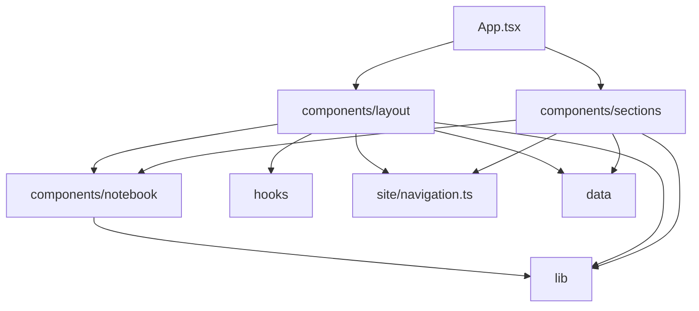

# Architecture

A static, single page React 19 + TypeScript + Vite + Tailwind CSS 4 site. No backend, database, environment variables, or runtime API calls. The build output (`dist`) is plain static files. Setup and commands are in [README.md](README.md); visual rules are in [DESIGN.md](DESIGN.md).

## Module map

| Module                    | Responsibility                                                  | Public API                                |
| ------------------------- | --------------------------------------------------------------- | ----------------------------------------- |
| `index.html`              | Metadata, fonts, theme bootstrap before React, `#root`.         | Static document                           |
| `src/main.tsx`            | Mounts React into `#root`.                                      | Entry point                               |
| `src/App.tsx`             | Composes layout and sections in page order.                     | `App`                                     |
| `src/data`                | All portfolio content and its types.                            | `src/data/index.ts`                       |
| `src/site/navigation.ts`  | Section anchors, labels, and icons in page order; logo path.    | `navSections`, `navSectionIds`, `logoUrl` |
| `src/components/layout`   | Page chrome: top `Nav` and mobile `BottomNav`.                  | `Nav`, `BottomNav`                        |
| `src/components/sections` | One file per page section; `ProjectCard` belongs to `Projects`. | One component per file                    |
| `src/components/notebook` | Content-free UI primitives of the notebook design system.       | `src/components/notebook/index.ts`        |
| `src/hooks`               | Browser state: persisted theme, active section observer.        | `useTheme`, `useActiveSection`            |
| `src/lib`                 | Framework-free helpers: class merging, new-tab link attributes. | `cn`, `newTabLinkProps`                   |
| `src/styles.css`          | Tailwind setup, theme tokens, typography utilities, layout.     | CSS classes and utilities                 |
| `scripts/dev.mjs`         | `npm run dev` launcher.                                         | CLI                                       |



## Dependency rules

Enforced by `npm run arch` ([.dependency-cruiser.cjs](.dependency-cruiser.cjs)); CI fails on any violation.

```text
App      -> layout, sections
layout   -> notebook, hooks, site, data, lib
sections -> notebook, data, site, lib
notebook -> lib only
hooks    -> (react only)
site     -> (icons only)
data, lib -> nothing inside src
```

- No cycles and no orphan modules.
- Sections never import other sections or layout, except `Projects` -> `ProjectCard`.
- Everything outside `src/components/notebook` imports primitives through its `index.ts`.

Duplicate code in `src` (TS, TSX, CSS) is blocked by `npm run dupes` (jscpd, threshold 0, 40 tokens, 4 lines).

## Where new code goes

- New or changed content: `src/data` only. Add or change the type in `types.ts` first.
- New page section: a file in `src/components/sections` wrapped in `PaperSheet`, an entry in `navSections` if it should appear in navigation, and one line in `App.tsx`.
- New reusable visual element: `src/components/notebook`, exported from `index.ts`, receiving content through props.
- New browser behaviour (storage, observers, media queries): a hook in `src/hooks`.
- New pure helper: a file in `src/lib` named by responsibility. No `utils`, `helpers`, or `common` files.
- New colour, font, or type size: a token or utility in `src/styles.css`, recorded in [DESIGN.md](DESIGN.md).

## Decisions

- **Single package, layered folders.** The site is about 1,800 lines across 27 source files (`npm run dupes`). A monorepo or feature packages would add ceremony without benefit.
- **Navigation defined once.** `Nav` and `BottomNav` both read `navSections`, which carries a full and a short label.
- **Hooks for side effects.** Theme persistence and section observation live in hooks so components only render.
- **One rule for link targets.** `newTabLinkProps` decides whether a link opens a new tab, so every off-page link behaves the same.
- **No tests beyond static checks.** There is no logic beyond rendering static data. Add Vitest when real logic appears (see growth signals).
- **No environment config.** Nothing is configurable per environment, so there is no `.env.example`.
- **One launcher.** `npm run dev` runs `scripts/dev.mjs`, which installs on lockfile change, fails fast on an unsupported Node version or a busy port, runs Vite with `--strictPort`, and kills the process tree on Ctrl+C. There is only one long-running process, so no extra terminal windows are opened.

## Allowed duplication

- `index.html` inline theme script repeats the `portfolio-theme` key and theme values from `src/hooks/useTheme.ts`. It must run before React loads to avoid a theme flash, so it cannot import the module.
- `index.html`, `public/robots.txt`, and `public/sitemap.xml` each contain the canonical site URL; they are static files served as is.
- The dark and light theme blocks in `src/styles.css` share token names by design; values differ.
- The Node version range appears in `package.json` `engines` and in the check inside `scripts/dev.mjs`.

## Known gaps

Found while writing this document and not yet fixed:

- `src/components/sections/ProjectCard.tsx` hard codes `target="_blank"` and `rel` instead of using `newTabLinkProps`, so it bypasses the single link rule.
- `src/styles.css` has dead rules: the classes `.desk-grid`, `.stat-num`, `.skill-card`, and `.project-card--featured` are used by no component, and `.hero-stamp::after`, `.paper-sheet::after`, `.timeline-stack::before`, and `.experience-card::before` only hide pseudo-elements nothing creates. Neither jscpd nor dependency-cruiser checks for unused CSS.

## Growth signals for the next pass

- Content edits by non-developers, or more than about 15 projects: move content to Markdown or MDX, or a headless CMS.
- More than one page or deep links: add a router and move to `src/features/<page>` folders.
- Any non-trivial logic (filtering, search, forms): add Vitest and Testing Library, with tests next to the code.
- Any runtime config (analytics, API keys): add validated `import.meta.env` config in `src/config.ts` and `.env.example`.
- JS bundle over about 300 kB gzip (currently 79.94 kB): lazy load sections below the fold.
