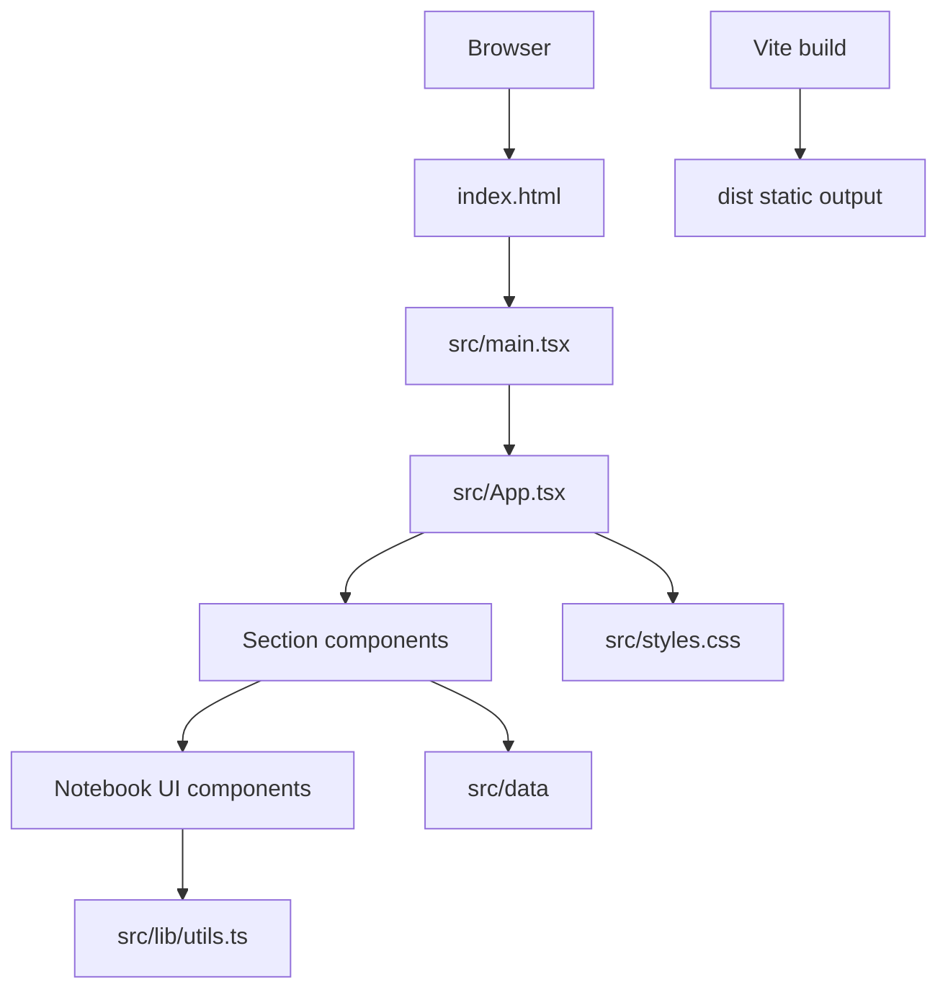

# Parth Mital Portfolio

A single page personal portfolio website for Parth Mital. It presents profile details, experience, selected projects, skills, education, resume access, and contact links through a notebook styled React interface.

## Table of contents

1. [Quick start](#quick-start)
2. [Project overview](#project-overview)
3. [Problem statement](#problem-statement)
4. [Project goals](#project-goals)
5. [Key features](#key-features)
6. [Supported use cases](#supported-use-cases)
7. [System architecture](#system-architecture)
8. [Application workflow](#application-workflow)
9. [Technology stack](#technology-stack)
10. [Repository structure](#repository-structure)
11. [Prerequisites](#prerequisites)
12. [Local installation](#local-installation)
13. [Dependency installation](#dependency-installation)
14. [Environment configuration](#environment-configuration)
15. [Running the application](#running-the-application)
16. [Available scripts and commands](#available-scripts-and-commands)
17. [API documentation](#api-documentation)
18. [Authentication and authorisation](#authentication-and-authorisation)
19. [Input validation](#input-validation)
20. [Error handling](#error-handling)
21. [Logging](#logging)
22. [Testing](#testing)
23. [Code quality checks](#code-quality-checks)
24. [Build process](#build-process)
25. [Production deployment](#production-deployment)
26. [CI or CD process](#ci-or-cd-process)
27. [Repository metrics](#repository-metrics)
28. [Security considerations](#security-considerations)
29. [Performance considerations](#performance-considerations)
30. [Monitoring and maintenance](#monitoring-and-maintenance)
31. [Troubleshooting](#troubleshooting)
32. [Known limitations](#known-limitations)
33. [Contribution guidelines](#contribution-guidelines)
34. [Coding standards](#coding-standards)
35. [Licence](#licence)
36. [Support and contact information](#support-and-contact-information)

## Quick start

Run these commands from the repository root:

```powershell
npm install
npm run dev
```

What the commands do:

1. `npm install`
   - Installs dependencies from `package-lock.json`.
   - Run it in the repository root, where `package.json` is present.
   - Expected result: `node_modules` is created and npm exits without errors.
   - Common error: if Node.js is too old, npm or Vite may fail. Install Node.js `^20.19.0 || >=22.12.0`.

2. `npm run dev`
   - Starts the Vite development server.
   - Run it in the repository root.
   - Expected result: Vite prints a local URL, usually `http://localhost:5173/`.
   - Common error: if port `5173` is already in use, Vite will offer another port.

The project was verified locally with:

```powershell
npm run build
npm run lint
```

Both commands passed in the current repository.

## Project overview

This project is a static portfolio site built with React, TypeScript, Vite, and Tailwind CSS. It does not use a backend, database, CMS, or external API calls.

The application renders seven main page sections:

1. Hero
2. About
3. Experience
4. Selected Projects
5. Skills
6. Education
7. Contact

The content is stored in TypeScript data files under `src/data`. The UI is built from section components under `src/components/sections` and reusable notebook components under `src/components/notebook`.

## Problem statement

The project solves a portfolio presentation problem:

- The owner needs one place to present profile, work, projects, skills, education, resume, and contact links.
- The site must be simple to update through source files.
- The site must work as a static frontend that can be deployed without backend infrastructure.
- The interface should be different from a generic portfolio template while remaining readable.

## Project goals

The verified goals in the repository are:

- Present Parth Mital's portfolio as a single page site.
- Keep portfolio data type checked through TypeScript interfaces.
- Provide project filtering by field.
- Provide expandable project and experience details.
- Provide mobile navigation and desktop navigation.
- Provide a persisted light and dark theme setting.
- Produce a static `dist` build through Vite.

## Key features

- Notebook styled visual system with ruled paper sections, margin lines, handwritten display fonts, and custom CSS utilities.
- Responsive top navigation for desktop and bottom navigation for mobile.
- Light and dark theme toggle stored in `localStorage` under `portfolio-theme`.
- Resume link to `/Parth_Mital_Resume.pdf`.
- Project filtering by seven project fields.
- Expand and collapse behaviour for project summaries and experience entries.
- Contact cards for email, GitHub, and LinkedIn.
- SEO metadata, Open Graph metadata, Twitter card metadata, JSON-LD, `robots.txt`, and `sitemap.xml`.
- Path alias support for `@/*` imports.

## Supported use cases

- View portfolio information in a browser.
- Filter projects by field.
- Open project GitHub links.
- Download or open the resume PDF.
- Contact the owner through email, GitHub, or LinkedIn.
- Update portfolio content by editing TypeScript files in `src/data`.
- Build the static site for hosting.

## System architecture



Architecture notes:

- `index.html` owns metadata, font links, theme bootstrap script, and the React root element.
- `src/main.tsx` mounts React into `#root`.
- `src/App.tsx` composes navigation, seven content sections, and mobile bottom navigation.
- `src/data` contains profile, project, experience, education, and skill data.
- `src/components/sections` renders page specific sections.
- `src/components/notebook` contains reusable UI primitives.
- `src/styles.css` defines Tailwind imports, theme tokens, CSS utilities, and responsive layout classes.

## Application workflow

### Page load workflow

1. Browser loads `index.html`.
2. The inline theme script reads `portfolio-theme` from `localStorage`.
3. React starts from `src/main.tsx`.
4. `App` renders navigation, page sections, and mobile bottom navigation.
5. Section components read static data from `src/data`.
6. CSS from `src/styles.css` applies the notebook design system.

### Theme workflow

1. `Nav.tsx` reads the initial theme from `localStorage`.
2. The theme button toggles between `dark` and `light`.
3. The selected theme is written to `document.documentElement.dataset.theme`.
4. The selected theme is saved back to `localStorage`.
5. The `theme-color` meta tag is updated for the selected theme.

### Project filtering workflow

1. `Projects.tsx` creates a unique sorted list of project fields from `projects`.
2. The user selects a `FilterPill`.
3. React updates `selectedField`.
4. `useMemo` recalculates the filtered project list.
5. `ProjectCard` renders only the matching projects.

### Mobile navigation workflow

1. `BottomNav.tsx` observes section elements with `IntersectionObserver`.
2. The active section changes when a section intersects the configured viewport band.
3. The matching mobile nav item receives active styling.
4. Tapping a nav item scrolls to the matching section.
5. Reduced motion preferences are respected by using instant scrolling when requested by the browser.

## Technology stack

Versions below are the exact installed versions from `package-lock.json`.

| Technology                    | Version | Purpose                                 | Where used                                        |
| ----------------------------- | ------: | --------------------------------------- | ------------------------------------------------- |
| React                         |  19.2.5 | UI rendering                            | `src/main.tsx`, `src/App.tsx`, components         |
| React DOM                     |  19.2.5 | Mounts React to the DOM                 | `src/main.tsx`                                    |
| TypeScript                    |   5.9.3 | Type checking and typed data models     | `src/**/*.ts`, `src/**/*.tsx`, `tsconfig.json`    |
| Vite                          |   7.3.2 | Development server and production build | `vite.config.ts`, npm scripts                     |
| `@vitejs/plugin-react`        |   5.2.0 | React support in Vite                   | `vite.config.ts`                                  |
| Tailwind CSS                  |   4.2.4 | Utility CSS and theme tokens            | `src/styles.css`, component classes               |
| `@tailwindcss/vite`           |   4.2.4 | Tailwind integration with Vite          | `vite.config.ts`                                  |
| `tw-animate-css`              |   1.4.0 | Animation utility import                | `src/styles.css`                                  |
| Lucide React                  | 0.575.0 | SVG icons                               | Navigation, buttons, contact cards, project cards |
| `clsx`                        |   2.1.1 | Conditional class values                | `src/lib/utils.ts`                                |
| `tailwind-merge`              |   3.5.0 | Tailwind class merging                  | `src/lib/utils.ts`                                |
| ESLint                        |  9.39.4 | Static code checks                      | `eslint.config.js`, `npm run lint`                |
| Prettier                      |   3.8.3 | Code formatting                         | `.prettierrc.json`, `npm run format`              |
| `prettier-plugin-tailwindcss` |   0.8.0 | Tailwind class formatting               | `.prettierrc.json`                                |

The project also uses Google Fonts through `index.html`: Caveat, Kalam, Architects Daughter, and Inter.

## Repository structure

```text
.
|-- .gitignore
|-- .prettierrc.json
|-- README.md
|-- eslint.config.js
|-- index.html
|-- package-lock.json
|-- package.json
|-- tsconfig.json
|-- vite.config.ts
|-- public
|   |-- Parth_Mital_Resume.pdf
|   |-- Portfolio Website.svg
|   |-- robots.txt
|   `-- sitemap.xml
`-- src
    |-- App.tsx
    |-- main.tsx
    |-- styles.css
    |-- components
    |   |-- notebook
    |   |   |-- Button.tsx
    |   |   |-- ContactCard.tsx
    |   |   |-- Eyebrow.tsx
    |   |   |-- FilterPill.tsx
    |   |   |-- PaperSheet.tsx
    |   |   |-- SectionHeading.tsx
    |   |   `-- index.ts
    |   `-- sections
    |       |-- About.tsx
    |       |-- BottomNav.tsx
    |       |-- Contact.tsx
    |       |-- Education.tsx
    |       |-- Experience.tsx
    |       |-- Hero.tsx
    |       |-- Nav.tsx
    |       |-- ProjectCard.tsx
    |       |-- Projects.tsx
    |       `-- Skills.tsx
    |-- data
    |   |-- index.ts
    |   |-- profile.ts
    |   |-- projects.ts
    |   `-- types.ts
    `-- lib
        `-- utils.ts
```

Important files:

- `package.json`: npm scripts and dependency ranges.
- `package-lock.json`: exact dependency versions.
- `vite.config.ts`: React plugin, Tailwind plugin, and `@` alias.
- `tsconfig.json`: TypeScript compiler settings and path alias.
- `eslint.config.js`: ESLint flat config for TypeScript, React hooks, React refresh, and Prettier.
- `.prettierrc.json`: tab indentation and Tailwind class sorting plugin.
- `index.html`: metadata, theme bootstrap script, fonts, JSON-LD, and React root.
- `src/styles.css`: Tailwind imports, theme tokens, custom utilities, and responsive layout CSS.
- `src/data/profile.ts`: profile, about, experience, education, and skills data.
- `src/data/projects.ts`: selected project data.
- `public/robots.txt`: crawl policy and sitemap location.
- `public/sitemap.xml`: sitemap with canonical portfolio URL.

## Prerequisites

Required:

- Node.js `^20.19.0 || >=22.12.0`, verified from `package-lock.json` for Vite 7.3.2.
- npm, verified locally with npm `11.12.1`.

Current local verification environment:

| Tool    | Version  |
| ------- | -------- |
| Node.js | v24.15.0 |
| npm     | 11.12.1  |

## Local installation

1. Clone the repository or open the project folder.
2. Open a terminal in the repository root.
3. Confirm that `package.json` exists:

```powershell
Get-Item package.json
```

Expected result: PowerShell prints the file entry for `package.json`.

## Dependency installation

Install dependencies:

```powershell
npm install
```

What this does:

- Reads `package.json` and `package-lock.json`.
- Installs packages into `node_modules`.
- Keeps dependency versions aligned with the lockfile.

This command was not rerun while preparing this README because `node_modules` already exists in the working copy and dependency versions were verified from `package-lock.json`.

## Environment configuration

No environment variables are required.

Search verification:

- No `import.meta.env` usage was found.
- No `process.env` usage was found.
- No `VITE_` environment variable usage was found.

| Variable       | Required | Purpose                                               | Expected format | Safe example value | Default value  | Security notes                       |
| -------------- | -------- | ----------------------------------------------------- | --------------- | ------------------ | -------------- | ------------------------------------ |
| Not applicable | No       | The repository does not define environment variables. | Not applicable  | Not applicable     | Not applicable | Do not add secrets to frontend code. |

## Database setup

No database setup is required. The repository does not contain database schemas, migrations, seed files, ORM configuration, or backend code.

## Running the application

Start the development server:

```powershell
npm run dev
```

What this does:

- Runs `vite`.
- Serves the React app locally.
- Enables Vite development behaviour for frontend changes.

Expected result:

- Vite prints a local URL.
- Vite commonly prints a URL on port `5173` when that port is available.
- If the first port is busy, Vite can use another port.

Preview a production build:

```powershell
npm run preview
```

What this does:

- Serves the existing `dist` output.
- It should be run after `npm run build`.

`npm run preview` starts a server process and was not executed during README verification because it keeps running until stopped.

## Available scripts and commands

| Command           | Defined in     | Purpose                             | Verification status                                                                  |
| ----------------- | -------------- | ----------------------------------- | ------------------------------------------------------------------------------------ |
| `npm run dev`     | `package.json` | Starts Vite development server.     | Verified from script definition. Not executed because it starts a persistent server. |
| `npm run build`   | `package.json` | Runs `tsc && vite build`.           | Executed successfully.                                                               |
| `npm run preview` | `package.json` | Serves `dist` through Vite preview. | Verified from script definition. Not executed because it starts a persistent server. |
| `npm run lint`    | `package.json` | Runs `eslint .`.                    | Executed successfully.                                                               |
| `npm run format`  | `package.json` | Runs `prettier --write .`.          | Verified from script definition. Not executed because it rewrites files.             |

## API documentation

This repository does not expose HTTP API endpoints.

Search verification found no Express, Fastify, router, server route, API handler, or frontend data fetching code in the repository source. Mentions of APIs inside `src/data` describe external portfolio projects, not endpoints exposed by this site.

## Authentication and authorisation

The portfolio site has no authentication or authorisation flow.

There are no login forms, JWT handlers, sessions, protected routes, or backend auth modules in this repository. Mentions of authentication inside project summaries describe separate projects.

## Input validation

Runtime input validation is minimal because the site has no user submitted forms.

Verified validation related behaviour:

- Portfolio data is shaped by TypeScript interfaces in `src/data/types.ts`.
- Project filters are generated from existing project fields, not from free text input.
- Theme selection is restricted to `dark` or `light` in `Nav.tsx` and the inline script in `index.html`.

There is no schema validation library such as Zod, Yup, Valibot, or Joi in `package.json`.

## Error handling

Verified error handling:

- The inline theme script in `index.html` wraps `localStorage` access in `try` and `catch`.
- If theme access fails, the document falls back to `dark`.
- React effects in `Nav.tsx` and `BottomNav.tsx` remove event listeners and disconnect observers during cleanup.

There is no global error boundary and no backend error handling because the repository is a static frontend.

## Logging

The repository does not define application logging.

Search verification found no `console.log`, logging utility, monitoring SDK, or server logs in the source files. Build and lint output comes from npm, TypeScript, ESLint, and Vite.

## Testing

There is no automated test suite in the current repository.

Search verification:

- No `.test.*` files were found.
- No `.spec.*` files were found.
- No test framework dependency such as Vitest, Jest, Playwright, Cypress, or Testing Library is defined in `package.json`.

Manual verification performed for this README:

```powershell
npm run build
npm run lint
```

Both commands passed.

Test coverage:

```text
Not measured in the current repository.
```

## Code quality checks

The available code quality command is:

```powershell
npm run lint
```

Result from verification:

```text
eslint .
```

The command exited successfully.

Formatting command:

```powershell
npm run format
```

This runs `prettier --write .`, which modifies files. It was not executed during README verification.

Formatting configuration:

- Tabs are enabled.
- Tab width is `2`.
- `prettier-plugin-tailwindcss` is configured.

## Build process

Build command:

```powershell
npm run build
```

The script runs:

```text
tsc && vite build
```

Verified build result:

| Output                           |  Raw size | Gzip size |
| -------------------------------- | --------: | --------: |
| `dist/index.html`                |   4.09 kB |   1.26 kB |
| `dist/assets/index-YoJ2Lf1R.css` |  31.09 kB |   6.83 kB |
| `dist/assets/index-MdRg_I9a.js`  | 247.47 kB |  78.63 kB |

Other verified build details:

| Metric                     |  Value |
| -------------------------- | -----: |
| Vite version used by build |  7.3.2 |
| Modules transformed        |   1748 |
| Reported build time        | 5.64 s |

These values are from the local build run and may change after source or dependency changes.

## Production deployment

This is a static frontend. The deployable output is the `dist` directory created by:

```powershell
npm run build
```

Deployment configuration present in the repository:

- No Vercel config file was found.
- No Netlify config file was found.
- No GitHub Actions workflow was found.
- `index.html`, `robots.txt`, and `sitemap.xml` reference `https://parthmital-portfolio.vercel.app/`.

Generic static hosting settings:

| Setting          | Value                       |
| ---------------- | --------------------------- |
| Build command    | `npm run build`             |
| Output directory | `dist`                      |
| App type         | Static single page frontend |

Do not run deployment commands without checking the target hosting provider and credentials.

## CI or CD process

No CI or CD workflow is present in the repository.

Verified absence:

- No `.github/workflows` directory was found.
- No deployment pipeline file was found in the repository root.

## Repository metrics

| Metric                               |                          Verified value | Source or command                                          | Notes                                                         |
| ------------------------------------ | --------------------------------------: | ---------------------------------------------------------- | ------------------------------------------------------------- |
| npm scripts                          |                                       5 | `package.json`                                             | `dev`, `build`, `preview`, `lint`, `format`                   |
| Direct dependencies                  |                                       8 | `package-lock.json`                                        | Root package dependencies                                     |
| Direct dev dependencies              |                                      15 | `package-lock.json`                                        | Root package dev dependencies                                 |
| Lockfile package entries             |                                     269 | `package-lock.json`                                        | Includes transitive packages                                  |
| Source TS, TSX, and CSS files        |                                      25 | Node file count over `src`                                 | Excludes `dist` and `node_modules`                            |
| TS files outside ignored output      |                                       7 | `rg --files -g '*.ts' -g '!node_modules/**' -g '!dist/**'` | Includes `vite.config.ts` and six `src` files                 |
| TSX files                            |                                      18 | Node file count                                            | Includes React components                                     |
| CSS files in `src`                   |                                       1 | Node file count                                            | `src/styles.css`                                              |
| Public files                         |                                       4 | `public` directory                                         | SVG, PDF, robots, sitemap                                     |
| Main page sections                   |                                       7 | `src/App.tsx`                                              | Hero, About, Experience, Projects, Skills, Education, Contact |
| Section component files              |                                      10 | `src/components/sections`                                  | Includes nav and project card components                      |
| Notebook component files             |                                       6 | `src/components/notebook`                                  | Reusable UI components                                        |
| Project entries                      |                                       7 | `src/data/projects.ts`                                     | Selected portfolio projects                                   |
| Unique project fields                |                                       7 | `src/data/projects.ts`                                     | Used for filtering                                            |
| Experience entries                   |                                       2 | `src/data/profile.ts`                                      | Rendered in Experience section                                |
| Education entries                    |                                       3 | `src/data/profile.ts`                                      | Rendered in Education section                                 |
| Technical skill groups               |                                       5 | `src/data/profile.ts`                                      | 29 technical skill items                                      |
| Creative skill groups                |                                       4 | `src/data/profile.ts`                                      | 26 creative tool items                                        |
| Environment variables                |                                       0 | `rg` search                                                | No env usage found                                            |
| API endpoints                        |                                       0 | `rg` search                                                | Static frontend only                                          |
| Test files                           |                                       0 | `rg --files` search                                        | No `.test` or `.spec` files                                   |
| Test coverage percentage             | Not measured in the current repository. | No coverage tool configured                                | No automated tests                                            |
| Custom dev port in repository config |                                       0 | `package.json` and `vite.config.ts`                        | No custom port is configured                                  |
| Build time                           |                                  5.64 s | `npm run build`                                            | Local verification run                                        |
| JS bundle size                       |            247.47 kB raw, 78.63 kB gzip | `npm run build`                                            | Current build output                                          |
| CSS bundle size                      |              31.09 kB raw, 6.83 kB gzip | `npm run build`                                            | Current build output                                          |

## Security considerations

Verified security relevant details:

- No secrets are required for local operation.
- No environment variables are read by the frontend.
- External links opened through reusable components use `target="_blank"` with `rel="noopener noreferrer"` when the URL starts with `http`.
- The resume PDF is a public asset.
- The site stores only the theme preference in `localStorage`.

Risks and notes:

- Any data placed in `src/data` is shipped to the browser.
- Do not store credentials, tokens, private keys, private contact details, or private project data in this repository.
- There is no Content Security Policy configured in `index.html`.
- Google Fonts are loaded from external Google font domains.

## Performance considerations

Verified performance related facts:

- The app is a static frontend with no runtime API calls found in source.
- The current build output has one JS bundle and one CSS bundle.
- The local build reported 1748 transformed modules.
- The JS gzip size from the verified build is 78.63 kB.
- The CSS gzip size from the verified build is 6.83 kB.
- `prefers-reduced-motion` is handled in CSS and in mobile scroll behaviour.

Not measured:

```text
Not measured in the current repository.
```

This applies to Lighthouse score, Core Web Vitals, runtime memory use, and real user monitoring.

## Monitoring and maintenance

No monitoring tool is configured.

Recommended maintenance tasks based on the repository:

- Run `npm run lint` before committing changes.
- Run `npm run build` before deployment.
- Keep `src/data/profile.ts` and `src/data/projects.ts` current.
- Update `public/Parth_Mital_Resume.pdf` when the resume changes.
- Update `public/sitemap.xml` if the canonical URL or last modified date changes.
- Check dependency updates against the Vite Node.js engine requirement before upgrading.

## Troubleshooting

| Problem                                        | Likely cause                                           | Diagnostic command                                           | Resolution                                                                   |
| ---------------------------------------------- | ------------------------------------------------------ | ------------------------------------------------------------ | ---------------------------------------------------------------------------- | ----------------------------------------------------------------- | ----------- |
| `npm install` fails with engine related errors | Node.js version is below Vite requirement              | `node --version`                                             | Install Node.js `^20.19.0                                                    |                                                                   | >=22.12.0`. |
| `npm run dev` cannot use port `5173`           | Another process is using the port                      | `netstat -ano                                                | findstr :5173`                                                               | Stop the other process or use the alternate port printed by Vite. |
| Import using `@/` fails                        | Path alias config was changed or is not loaded         | `Get-Content tsconfig.json` and `Get-Content vite.config.ts` | Ensure `@/*` maps to `./src/*` in TypeScript and `@` maps to `/src` in Vite. |
| Theme does not persist                         | Browser storage is blocked or cleared                  | Check browser site data settings                             | Allow local storage or use the default dark theme.                           |
| Resume link returns 404                        | PDF missing from public assets or build output         | `Get-Item public/Parth_Mital_Resume.pdf`                     | Restore the PDF at that path and rebuild.                                    |
| Production preview has stale files             | `dist` was not rebuilt                                 | `npm run build`                                              | Rebuild before running `npm run preview`.                                    |
| Lint fails after edits                         | TypeScript, hooks, refresh, or Prettier rule violation | `npm run lint`                                               | Fix the reported file and line, then rerun lint.                             |

## Known limitations

- No automated tests are configured.
- No backend, database, or API layer exists in this repository.
- Content updates require source edits and a rebuild.
- No CMS integration exists.
- No analytics or monitoring integration exists.
- No CI or CD configuration is present.
- No runtime form submission exists in the contact section.
- No licence file is present.

## Contribution guidelines

For changes to this repository:

1. Create a branch for the change.
2. Install dependencies with `npm install`.
3. Make focused changes.
4. Run lint:

```powershell
npm run lint
```

5. Run build:

```powershell
npm run build
```

6. Commit only relevant files.

Good contribution areas:

- Accessibility improvements.
- Test coverage.
- Content updates.
- Styling fixes that preserve the notebook design system.
- Build or deployment configuration if a hosting target is selected.

## Coding standards

Follow the existing repository style:

- Use TypeScript for source files.
- Use React function components.
- Keep portfolio content in `src/data`.
- Keep reusable primitives in `src/components/notebook`.
- Keep page sections in `src/components/sections`.
- Use the `cn` helper from `src/lib/utils.ts` when conditional class merging is needed.
- Use the `@/` import alias for source imports.
- Use tabs for indentation, as configured in `.prettierrc.json`.
- Run `npm run lint` after non trivial code changes.

## Licence

No licence file is present in the repository.

Without an explicit licence, do not reuse, redistribute, or publish this code as your own without permission from the repository owner.

## Support and contact information

Contact details are defined in `src/data/profile.ts` and rendered in the Contact section:

| Channel  | Value                                |
| -------- | ------------------------------------ |
| Email    | `parth.mital.2004@gmail.com`         |
| GitHub   | `https://github.com/parthmital`      |
| LinkedIn | `https://linkedin.com/in/parthmital` |
